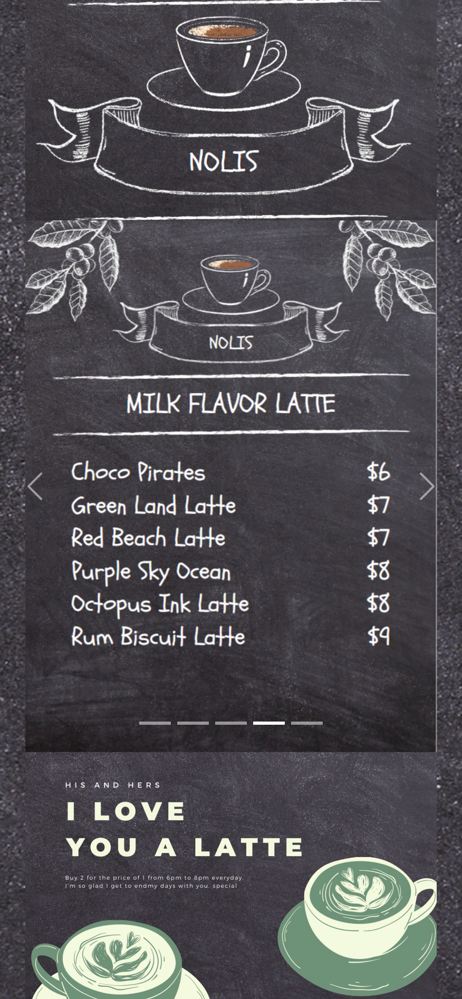
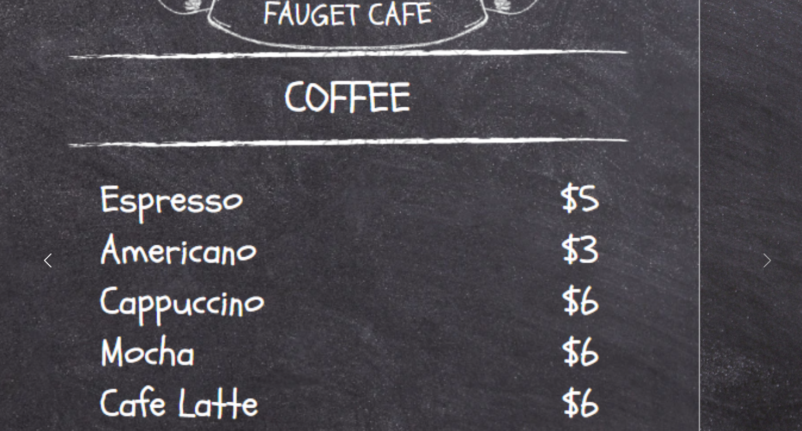
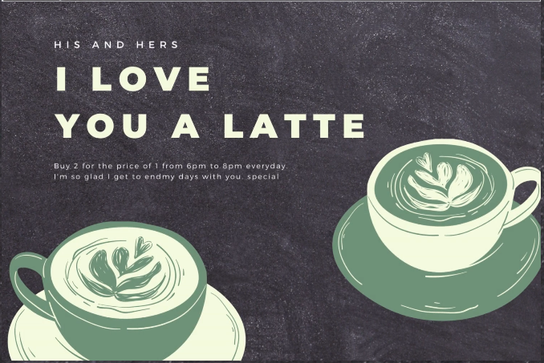

# A Restaurant Menu
====================================================================================

A web based menu for restaurants.  It should resolve some issues and help the business increase sales.

the menu should:

- have a easy and user friendly U/I
- be fluid and natural when used
- it should be responsive (Primarly use is for moblie devices that are connected to the internet and can read QR codes.)

pictures of a sample menu below :
Phone View             |  Desktop View
:-------------------------:|:-------------------------:
  |  

====================================================================================
## Who will use the menu? I have a regular paper menu.

- the customers who naturally use their phones for most things.
- if you have a line of people waiting. They can view your products while they wait.
- people who search for your business online if you have it linked to your business

You have unlimited space to showcase the products 

You can add a section for advertising certain things at certain times like happy hour or valentines day specials like the one below

 

some requirements / specifications for the menu:
- statically created
- under 8MB in size
- fastload time 

[Menu - 2](https://novaxiophi.github.io/restaurantMenu/).

_please look at the above example and let me know what you think.   Any ideas you think i can include please help out._

====================================================================================
## FAQ

1. What's the license? 
    [MIT](http://en.wikipedia.org/wiki/MIT_License).
2. what will this resolve?
    increase sales of items.
3. I work at a big company that requires a version number on this third party code before I can use it. Do you have a version number?
    Sure, current version: 1.0
